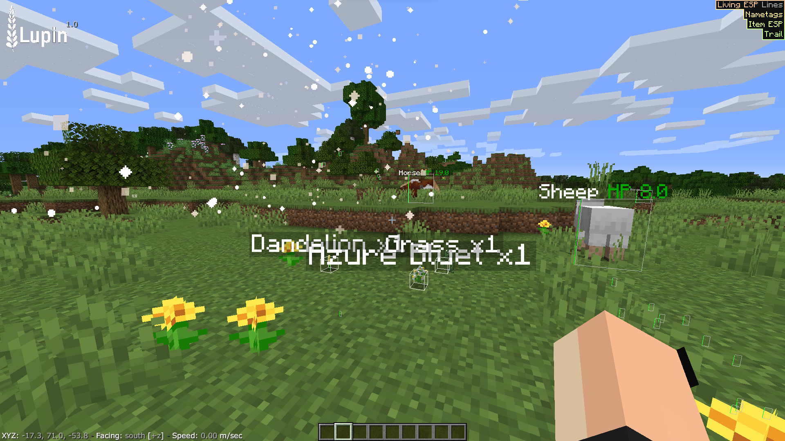
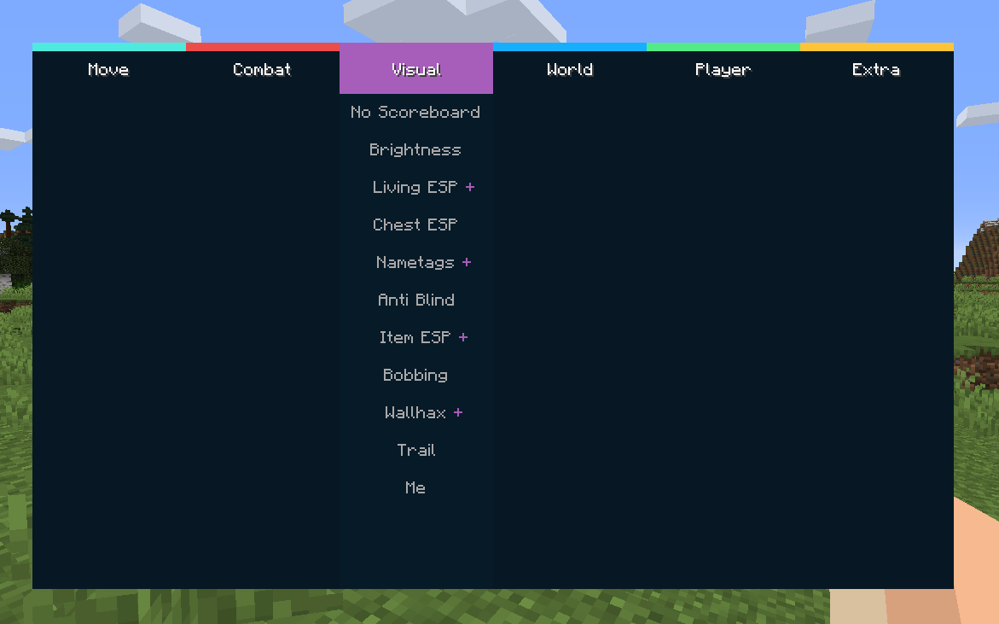
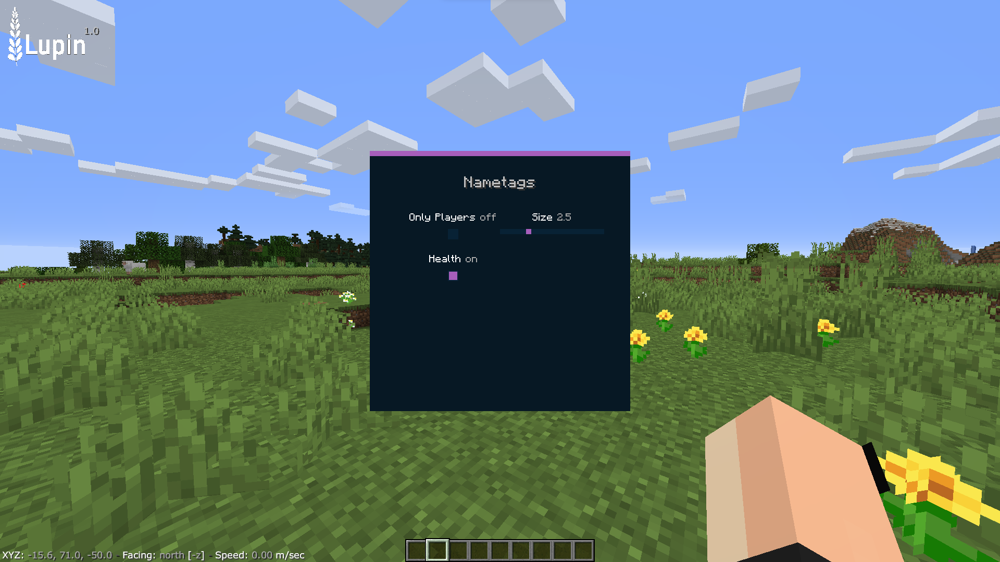

# Lupin

Lupin is a Minecraft Forge mod that brings utilities that normal Minecraft does not allow. With a range of modules, such as speed that makes you much faster,
visualization modifications that renders entities health and twerk that makes you shake.

## Installation

1. Install **Minecraft 1.15.2** with **Forge**.
2. Download the latest mod `.jar` from the [Releases](../../releases) page.
3. Place the `.jar` file into your Minecraft `mods` folder.
4. Launch Minecraft using the **Forge 1.15.2** profile.

## Development

### Requirements
Java 8

### Clone the repository
git clone https://github.com/gustavvising/Lupin.git

cd Lupin

### Build
./gradlew build

Output is saved to: \build\libs\Lupin.jar

## Screenshots

