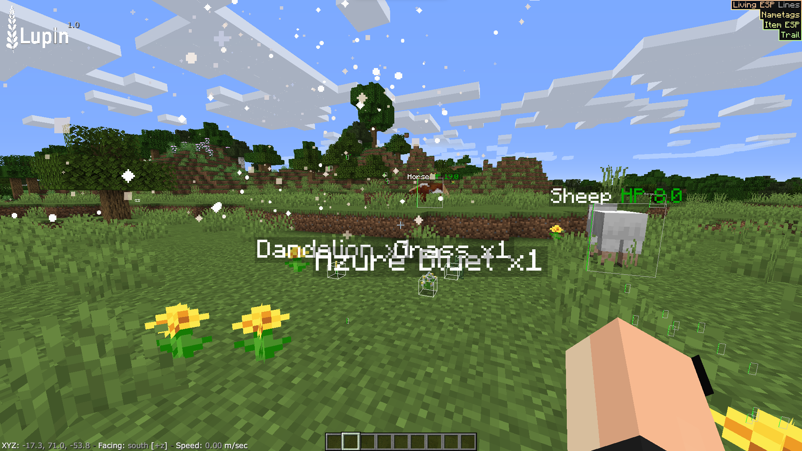
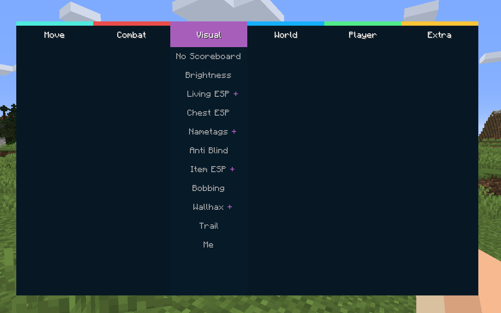
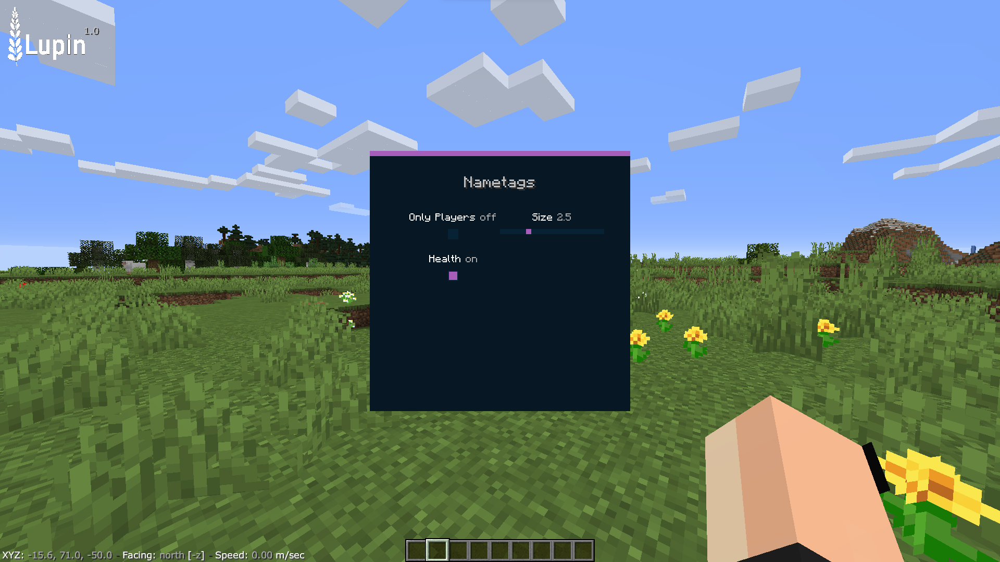
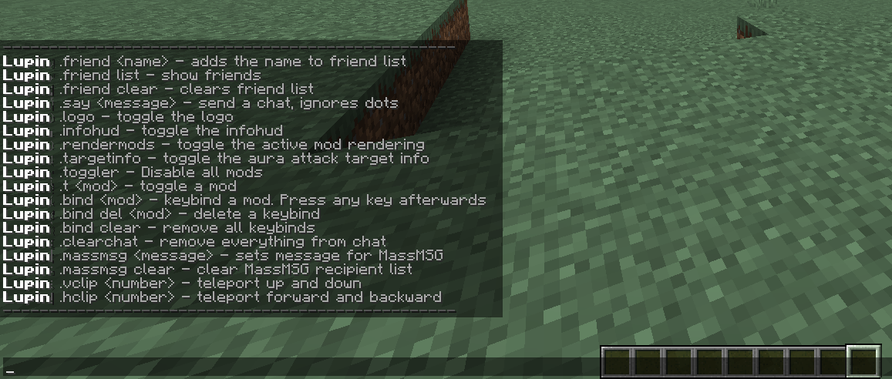

# Lupin

Lupin is a Minecraft Forge mod that adds utilities and features that are
not available in vanilla Minecraft. It includes modules such as Speed,
which increases movement speed, Visuals, which displays entity health,
and Twerk, which makes the player shake.

## Installation

1. Install **Minecraft 1.15.2** with **Forge**.
2. Download the latest `.jar` from the [Releases](../../releases) page.
3. Place the `.jar` file in your Minecraft `mods` folder.
4. Launch Minecraft using the **Forge 1.15.2** profile.

## Development

### Requirements

- Java 8

### Clone the repository

```bash
git clone https://github.com/gustavvising/Lupin.git
cd Lupin
```

### Build

```bash
./gradlew build
```

Output:

```text
build/libs/Lupin.jar
```

## Screenshots



<br>



<br>



<br>



<br>

